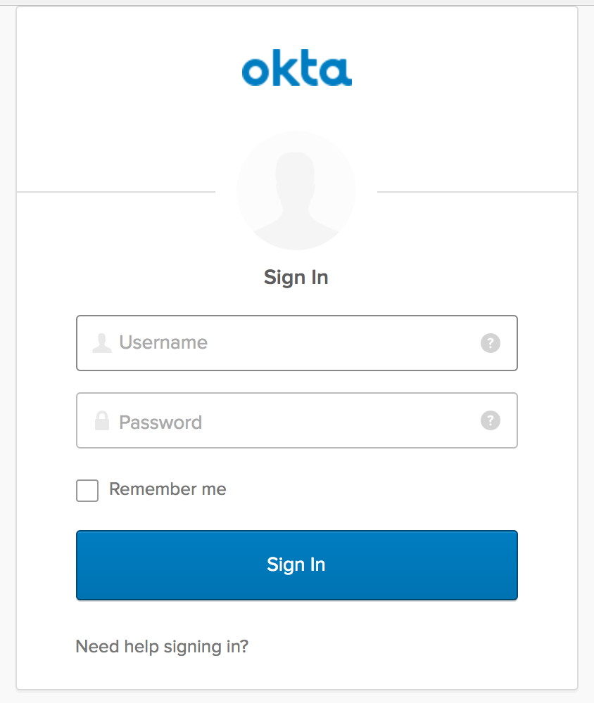

# AngularJS 1.x and Slim Sample Application

### Table of Contents

  - [Introduction](#introduction)
    - [Login Redirect](#1-login-redirect)
    - [Custom Login Form](#2-custom-login-form)
  - [Prerequisites](#prerequisites)
  - [Quick Start](#quick-start)
  - [Front End](#front-end)
    - [Login Redirect](#login-redirect)
    - [Custom Login Form](#custom-login-form)
    - [Using a different front-end](#using-a-different-front-end)
  - [Back End](#back-end)
    - [Routes](#routes)
    - [Handle the Redirect](#handle-the-redirect)
    - [Code Exchange](#code-exchange)
    - [Validation](#validation)
  - [Set User Session](#set-user-session)
  - [Logout](#logout)
  - [Conclusion](#conclusion)
  - [Support](#support)
  - [License](#license)
  
## Introduction

This tutorial will demonstrate how to use OAuth 2.0 and OpenID Connect to add authentication to a PHP/Slim application.

### 1. Login Redirect

Users are redirected to your Okta organization for authentication.



After logging into your Okta organization, an authorization code is returned in a callback URL. This authorization code is then exchanged for an `id_token`.

### 2. Custom Login Form

The Okta Sign-In Widget is a fully customizable login experience. You can change how the widget [looks with CSS](http://developer.okta.com/code/javascript/okta_sign-in_widget#customizing-style-with-css) and [is configured with JavaScript](http://developer.okta.com/code/javascript/okta_sign-in_widget#customizing-widget-features-and-text-labels-with-javascript).


This custom-branded login experience uses the [Okta Sign-In Widget](http://developer.okta.com/code/javascript/okta_sign-in_widget) to perform authentication, returning an authorization code that is then exchanged for an `id_token`.

## Prerequisites

This sample app depends on [Node.js](https://nodejs.org/en/) for front-end dependencies and some build scripts - if you don't have it, install it from [nodejs.org](https://nodejs.org/en/).

```bash
# Verify that node is installed
$ node -v
```

Then, clone this sample from GitHub and install the front-end dependencies:
```bash
# Clone the repo and navigate to the samples-php-slim-3 dir
$ git clone git@github.com:okta/samples-php-slim-3.git && cd samples-php-slim-3

# Install the front-end dependencies
[samples-php-slim-3]$ npm install
```

After all the front-end dependencies install, you will need to install all composer packages:
```bash
[samples-php-slim-3]$ cd src; composer install
```


## Quick Start

Start the back-end for your sample application with `npm start` or ` php -S 0.0.0.0:3000 -t src/public `. This will start the app server on [http://localhost:3000](http://localhost:3000).

By default, this application uses a mock authorization server which responds to API requests like a configured Okta org - it's useful if you haven't yet set up OpenID Connect but would still like to try this sample. 

To start the mock server, run the following in a second terminal window:
```bash
# Starts the mock Okta server at http://127.0.0.1:7777
[samples-php-slim-3]$ npm run mock-okta
```

If you'd like to test this sample against your own Okta org, follow [these steps to setup an OpenID Connect app](docs/assets/oidc-app-setup.md). Then, replace the *oidc* settings in `samples.config.json` to point to your new app:
```javascript
// .samples.config.json
{
  "oidc": {
    "oktaUrl": "https://{{yourOktaOrg}}.oktapreview.com",
    "clientId": "{{yourClientId}}",
    "clientSecret": "{{yourClientSecret}}",
    "redirectUri": "http://localhost:3000/authorization-code/callback"
  }
}
```

## Front-end

When you start this sample, the [AngularJS 1.x UI](https://github.com/okta/samples-js-angular-1) is copied into the `dist/` directory. More information about the AngularJS controllers and views are available in the [AngularJS project repository](https://github.com/okta/samples-js-angular-1/blob/master/README.md).

### Login Redirect

With AngularJS, we include the template directive `ng-click` to begin the login process. When the link is clicked, it calls the `login()` function defined in `login-redirect.controller.js`. Let’s take a look at how the `OktaAuth` object is created.

```javascript
// login-redirect.controller.js

class LoginRedirectController {
   constructor(config) {
    this.config = config;
  }
   $onInit() {
    this.authClient = new OktaAuth({
      url: this.config.oktaUrl,
      clientId: this.config.clientId,
      redirectUri: this.config.redirectUri,
      scopes: ['openid', 'email', 'profile'],
    });
  }
 
  login() {
    this.authClient.token.getWithRedirect({ responseType: 'code' });
  }
}
```

There are a number of different ways to construct the login redirect URL.

1. Build the URL manually
2. Use an OpenID Connect / OAuth 2.0 middleware library
3. Use [AuthJS](http://developer.okta.com/code/javascript/okta_auth_sdk)

In this sample, we use AuthJS to create the URL and perform the redirect. An `OktaAuth` object is instantiated with the configuration in `.samples.config.json`. When the `login()` function is called from the view, it calls the [`/authorize`](http://developer.okta.com/docs/api/resources/oauth2.html#authentication-request) endpoint to start the [Authorization Code Flow](https://tools.ietf.org/html/rfc6749#section-1.3.1).
 

You can read more about the `OktaAuth` configuration options here: [OpenID Connect with Okta AuthJS SDK](http://developer.okta.com/code/javascript/okta_auth_sdk#social-authentication-and-openid-connect).

**Important:** When the authorization code is exchanged for an `access_token` and/or `id_token`, the tokens **must** be [validated](#validation). We'll cover that in a bit.

### Custom Login Form
To render the [Okta Sign-In Widget](http://developer.okta.com/code/javascript/okta_sign-in_widget), include a container element on the page for the widget to attach to:

```html
<!-- overview.mustache -->
<div id="sign-in-container"></div>
```

Then, initialize the widget with the [OIDC configuration](https://github.com/okta/okta-signin-widget#openid-connect) options:
``` javascript
// login-custom.controller.js
class LoginCustomController {
  constructor(config) {
    this.config = config;
  }
 
  $onInit() {
    const signIn = new SignIn({
      baseUrl: this.config.oktaUrl,
      clientId: this.config.clientId,
      redirectUri: this.config.redirectUri,
      authParams: {
        responseType: 'code',
        scopes: ['openid', 'email', 'profile'],
      },
    });
    signIn.renderEl({ el: '#sign-in-container' }, () => {});
  }
}
```
To perform the [Authorization Code Flow](https://tools.ietf.org/html/rfc6749#section-1.3.1), we set the `responseType` to `code`. This returns an `access_token` and/or `id_token` through the [`/token`](http://developer.okta.com/docs/api/resources/oauth2.html#token-request) OpenID Connect endpoint.

**Note:** Additional configuration for the `SignIn` object is available at [OpenID Connect, OAuth 2.0, and Social Auth with Okta](https://github.com/okta/okta-signin-widget#configuration).

### Using a different front-end

By default, this end-to-end sample ships with our [Angular 1 front-end sample](https://github.com/okta/samples-js-angular-1). To run this back-end with a different front-end:

1. Choose the front-end

    | Framework | NPM module | Github |
    |-----------|------------|--------|
    | Angular 1 | [@okta/samples-js-angular-1](https://www.npmjs.com/package/@okta/samples-js-angular-1) | https://github.com/okta/samples-js-angular-1 |
    | React | [@okta/samples-js-react](https://www.npmjs.com/package/@okta/samples-js-react) | https://github.com/okta/samples-js-react |
    | Elm | [@okta/samples-elm](https://www.npmjs.com/package/@okta/samples-elm) | https://github.com/okta/samples-elm |


2. Install the front-end

    ```bash
    # Use the NPM module for the front-end you want to install. I.e. for React:
    [samples-php-slim-3]$ npm install @okta/samples-js-react
    ```

3. Restart the server. You should be up and running with the new front-end!

## Back-end
To complete the [Authorization Code Flow](https://tools.ietf.org/html/rfc6749#section-1.3.1), your back-end server performs the following tasks:
  - Handle the [Authorization Code code exchange](https://tools.ietf.org/html/rfc6749#section-1.3.1) callback
  - [Validate](http://openid.net/specs/openid-connect-core-1_0.html#IDTokenValidation) the `id_token`
  - Set `user` session in the app
  - Log the user out

### Routes
To render the AngularJS templates, we define the following Slim routes:

| Route                                 | Description                                                 |
| ------------------------------------- | ----------------------------------------------------------- |
| **authorization-code/login-redirect** | renders the [login redirect](#login-redirect) flow          |
| **authorization-code/login-custom**   | renders the [custom login](#custom-login-form) flow         |
| **authorization-code/callback**       | handles the redirect from Okta                              |
| **authorization-code/profile**        | renders the logged in state, displaying profile information |
| **authorization-code/logout**         | closes the `user` session                                   |

### Handle the Redirect
After successful authentication, an authorization code is returned to the redirectUri:
```
http://localhost:3000/authorization-code/callback?code={{code}}&state={{state}}
```

Two cookies are created after authentication: `okta-oauth-nonce` and `okta-auth-state`. You **must** verify the returned `state` value in the URL matches the `state` value created.

In this sample, we verify the state here:

```php
if ( $request->getCookieParam('okta-oauth-state') != $request->getQueryParam('state')) {
    return $response->withStatus(401);
}
```

### Code Exchange
Next, we exchange the returned authorization code for an `id_token` and/or `access_token`. You can choose the best [token authentication method](http://developer.okta.com/docs/api/resources/oauth2.html#token-request) for your application. In this sample, we use the default token authentication method `client_secret_basic`:

```php
$authHeaderSecret = base64_encode($config->oidc->clientId . ':' . $config->oidc->clientSecret);

$query = http_build_query([
    'grant_type' => 'authorization_code',
    'code' => $request->getQueryParam('code'),
    'redirect_uri' => $config->oidc->redirectUri
]);

$headers = [
    'Authorization: Basic ' . $authHeaderSecret,
    'Accept: application/json',
    'Content-Type: application/x-www-form-urlencoded',
    'Connection: close',
    'Content-Length: 0'
];
$url = $config->oidc->oktaUrl . '/oauth2/v1/token?' . $query;

$ch = curl_init();
curl_setopt($ch, CURLOPT_URL, $url);
curl_setopt($ch, CURLOPT_RETURNTRANSFER, 1);
curl_setopt($ch, CURLOPT_HEADER, 0);
curl_setopt($ch, CURLOPT_HTTPHEADER, $headers);
curl_setopt($ch, CURLOPT_POST, 1);


$output = curl_exec($ch);
$httpcode = curl_getinfo($ch, CURLINFO_HTTP_CODE);

if(curl_error($ch))
{
	$httpcode = 500;
}
$decodedOutput = json_decode($output);
```

A successful response returns an `id_token` which looks similar to:
```
eyJhbGciOiJSUzI1NiJ9.eyJzdWIiOiIwMHVpZDRCeFh3Nkk2VFY0bTBnMyIsImVtYWlsIjoid2VibWFzd
GVyQGNsb3VkaXR1ZGUubmV0IiwiZW1haWxfdmVyaWZpZWQiOnRydWUsInZlciI6MSwiaXNzIjoiaHR0cD
ovL3JhaW4ub2t0YTEuY29tOjE4MDIiLCJsb2dpbiI6ImFkbWluaXN0cmF0b3IxQGNsb3VkaXR1ZGUu
bmV0IiwiYXVkIjoidUFhdW5vZldrYURKeHVrQ0ZlQngiLCJpYXQiOjE0NDk2MjQwMjYsImV4cCI6MTQ0O
TYyNzYyNiwiYW1yIjpbInB3ZCJdLCJqdGkiOiI0ZUFXSk9DTUIzU1g4WGV3RGZWUiIsImF1dGhfdGltZSI
6MTQ0OTYyNDAyNiwiYXRfaGFzaCI6ImNwcUtmZFFBNWVIODkxRmY1b0pyX1EifQ.Btw6bUbZhRa89
DsBb8KmL9rfhku--_mbNC2pgC8yu8obJnwO12nFBepui9KzbpJhGM91PqJwi_AylE6rp-
ehamfnUAO4JL14PkemF45Pn3u_6KKwxJnxcWxLvMuuisnvIs7NScKpOAab6ayZU0VL8W6XAijQmnYTt
MWQfSuaaR8rYOaWHrffh3OypvDdrQuYacbkT0csxdrayXfBG3UF5-
ZAlhfch1fhFT3yZFdWwzkSDc0BGygfiFyNhCezfyT454wbciSZgrA9ROeHkfPCaX7KCFO8GgQEkGRoQ
ntFBNjluFhNLJIUkEFovEDlfuB4tv_M8BM75celdy3jkpOurg
```

### Validation
After receiving the `id_token`, we [validate](http://openid.net/specs/openid-connect-core-1_0.html#IDTokenValidation) the token and its claims to prove its integrity. 

In this sample, we use the ["gree/jose"](https://packagist.org/packages/gree/jose) library to decode and validate the token.

There are a couple things we need to verify:

1. [Verify the signature](#verify-signature)
2. [Verify the *iss* (issuer), *aud* (audience), and *exp* (expiry) time](#verify-fields)
3. [Verify the *iat* (issued at) time](#verify-issued-time)
4. [Verify the *nonce*](#verify-nonce)

You can learn more about validating tokens in [OpenID Connect Resources](http://developer.okta.com/docs/api/resources/oidc.html#validating-id-tokens).

#### Verify signature
An `id_token` contains a [public key id](https://tools.ietf.org/html/rfc7517#section-4.5) (`kid`). To verify the signature, we use the [Discovery Document](http://developer.okta.com/docs/api/resources/oidc.html#openid-connect-discovery-document) to find the `jwks_uri`, which will return a list of public keys. It is safe to cache or persist these keys for performance, but Okta rotates them periodically. We strongly recommend dynamically retrieving these keys.

For example:
- If the `kid` has been cached, use it to validate the signature.
- If not, make a request to the `jwks_uri`. Cache the new `jwks`, and use the response to validate the signature.

```php
$jwk = null;

if(file_exists(__DIR__ . '/../../src/storage/cache/' . $kid)) {
    $jwk = file_get_contents(__DIR__ . '/../../src/storage/cache/' . $kid);
    $jwk = unserialize($jwk);
}
else {

    $ch = curl_init();
    curl_setopt($ch, CURLOPT_URL, $config->oidc->oktaUrl . '/oauth2/v1/keys');
    curl_setopt($ch, CURLOPT_RETURNTRANSFER, 1);
    curl_setopt($ch, CURLOPT_HEADER, 0);

    $output = curl_exec($ch);

    curl_close($ch);

    $output = json_decode($output);

    foreach ($output->keys as $key) {
        // poormans cache
        $s = serialize($key);
        file_put_contents(__DIR__ . '/../../src/storage/cache/' . $key->kid, $s);

        $cachedJwks[$key->kid] = $key;
        if ($key->kid == $kid) {
            $jwk = $key;
        }
    }
}

```


#### Verify fields

Verify the `id_token` from the [Code Exchange](#code-exchange) contains our expected claims:

  - The `issuer` is identical to the host where authorization was performed
  - The `clientId` stored in our configuration matches the `aud` claim
  - If the token expiration time has passed, the token must be revoked

```php

if($res->claims['iss'] != $config->oidc->oktaUrl) {
    return $response->withStatus(401);
}

if($res->claims['aud'] != $config->oidc->clientId) {
    return $response->withStatus(401);
}

if($res->claims['exp'] < time()-300) {
    return $response->withStatus(401);
}


```


#### Verify issued time
The `iat` value indicates what time the token was "issued at". We verify that this claim is valid by checking that the token was not issued in the future, with some leeway for clock skew.

```php
if($res->claims['iat'] > time()+300) {
    return $response->withStatus(401);
}
```


#### Verify nonce
To mitigate replay attacks, verify that the `nonce` value in the `id_token` matches the `nonce` stored in the cookie `okta-oauth-nonce`.

```php
if($res->claims['nonce'] != $request->getCookieParam('okta-oauth-nonce')) {
    return $response->withStatus(401);
}
```

### Set user session
If the `id_token` passes validation, we can then set the `user` session in our application.

In a production app, this code would lookup the `user` from a user store and set the session for that user. However, for simplicity, in this sample we set the session with the claims from the `id_token`.

```php
$userData = [
    'email' => $res->claims['email'],
    'claims' => $res->claims
];


$userCookie = new Cookie('userData', serialize($userData), time() + 30, '/', 'localhost', false, false);

return $response->withAddedHeader('Set-Cookie', $userCookie)->withRedirect('/authorization-code/profile');
```

### Logout
In Slim, you can clear the the user session by:

```php
$userCookie = new Cookie('userData', 'EXPIRED', 1, '/', 'localhost', false, false);

return $response->withAddedHeader('Set-Cookie', $userCookie)->withRedirect('/');
```

The Okta session is terminated in our client-side code.

## Conclusion
You have now successfully authenticated with Okta! Now what? With a user's `id_token`, you have basic claims into the user's identity. You can extend the set of claims by modifying the `response_type` and `scopes` to retrieve custom information about the user. This includes `locale`, `address`, `phone_number`, `groups`, and [more](http://developer.okta.com/docs/api/resources/oidc.html#scopes).

## Support 

Have a question or see a bug? Email developers@okta.com. For feature requests, feel free to open an issue on this repo. If you find a security vulnerability, please follow our [Vulnerability Reporting Process](https://www.okta.com/vulnerability-reporting-policy/).

## License

Copyright 2017 Okta, Inc. All rights reserved.

Licensed under the Apache License, Version 2.0 (the "License"); you may not use this file except in compliance with the License. You may obtain a copy of the License at http://www.apache.org/licenses/LICENSE-2.0.

Unless required by applicable law or agreed to in writing, software distributed under the License is distributed on an "AS IS" BASIS, WITHOUT WARRANTIES OR CONDITIONS OF ANY KIND, either express or implied. See the License for the specific language governing permissions and limitations under the License.

